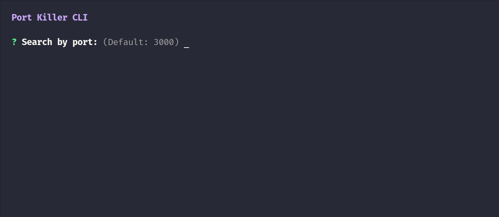

# Port Killer CLI

Search by port and stop each process quickly.



```
npm install -g port-killer-cli
```

Should be installed globally since it is a CLI app and not used in a actual app.

```
"dependencies": {
  "chalk": "^5.0.1",
  "chalk-animation": "^2.0.2",
  "columnify": "^1.6.0",
  "inquirer": "^8.2.4"
}
```

https://www.npmjs.com/package/port-killer-cli

License under MIT.
